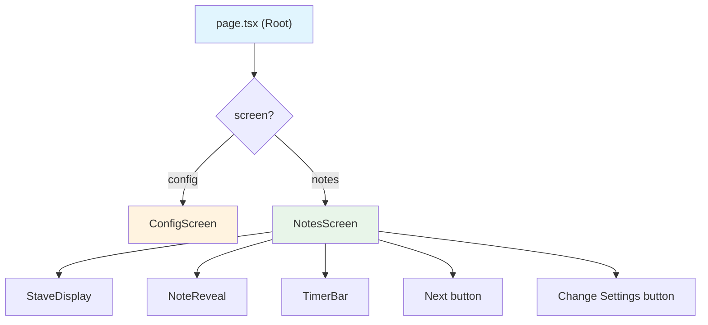
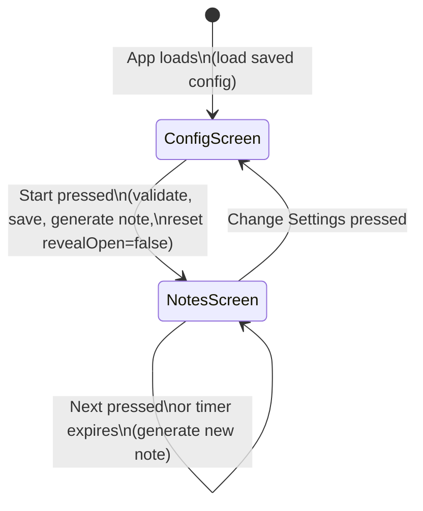
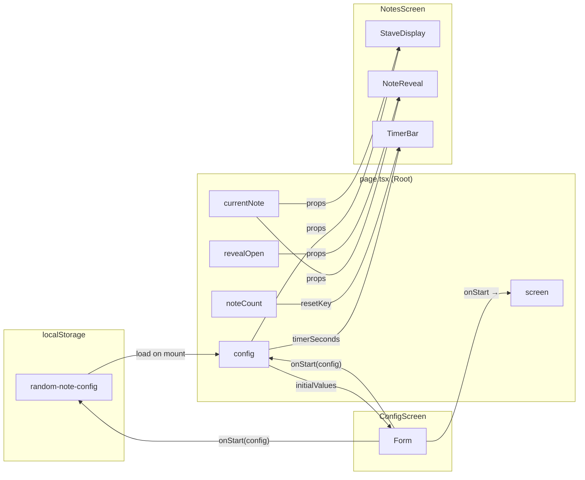

# Technical Architecture

See also: [Music Theory Logic](music-theory.md) | [Testing Strategy](testing.md) | [Deployment](deployment.md) | [Product Specification](spec.md)

---

## 1. Tech Stack & Dependencies

Prefer established libraries over custom implementations for UI, notation, storage helpers, and testing. Keep app-specific music logic in `src/lib/`.

### Core

| Package | Purpose |
|---|---|
| `next` | Framework (App Router, static export) |
| `react` / `react-dom` | UI runtime |
| `typescript` | Type safety |

### UI

| Package | Purpose |
|---|---|
| `@mantine/core` | Component library |
| `@mantine/hooks` | Utility hooks (e.g. `useLocalStorage`) |
| `@tabler/icons-react` | Icon library |
| `@mantine/form` | Form state management for the config screen |
| `postcss` / `postcss-preset-mantine` | Mantine styling pipeline |
| `postcss-simple-vars` | CSS variable support for Mantine |

### Music Notation

| Package | Purpose |
|---|---|
| `vexflow` | Stave, clef, key signature, and note rendering on HTML Canvas or SVG |

### Testing

| Package | Purpose |
|---|---|
| `vitest` | Unit / integration / property test runner |
| `@testing-library/react` | React component testing |
| `@testing-library/jest-dom` | DOM assertion matchers |
| `@testing-library/user-event` | Simulating user interactions |
| `jsdom` | DOM environment for Vitest |
| `fast-check` | Property-based testing / fuzzing for note generation |
| `@playwright/test` | End-to-end browser testing |

### Tooling

| Package | Purpose |
|---|---|
| `eslint` / `eslint-config-mantine` | Linting |
| `prettier` | Code formatting |
| `serve` | Serve static build locally (`npm run start`) |

---

## 2. Project Structure

```
random-note/
├── docs/
│   ├── spec.md                          # Product specification
│   ├── architecture.md                  # This file
│   ├── music-theory.md                  # Music logic: types, algorithms, constants
│   ├── testing.md                       # Testing strategy
│   └── deployment.md                    # CI/CD and deployment
├── src/
│   ├── app/
│   │   ├── layout.tsx                   # Root layout (Mantine provider, fonts, meta)
│   │   ├── page.tsx                     # Single-page app root
│   │   └── globals.css                  # Global styles (Mantine + custom)
│   ├── components/
│   │   ├── ConfigScreen.tsx             # Home / config screen
│   │   ├── NotesScreen.tsx              # Random notes screen
│   │   ├── StaveDisplay.tsx             # VexFlow stave renderer
│   │   ├── NoteReveal.tsx               # Expandable note name display
│   │   └── TimerBar.tsx                 # Countdown progress bar
│   ├── lib/
│   │   ├── types.ts                     # Shared TypeScript types
│   │   ├── constants.ts                 # Key signatures, clefs, transposition data
│   │   ├── noteGenerator.ts             # Random note generation algorithm
│   │   ├── transposition.ts             # Written ↔ concert pitch conversion
│   │   ├── noteUtils.ts                 # MIDI conversion, note name parsing, enharmonic utilities
│   │   └── vexflowUtils.ts              # VexFlow key/accidental helpers
│   └── hooks/
│       ├── useTimer.ts                  # Timer hook (start, reset, onExpire callback)
│       └── useTone.ts                   # Tone hook (sine oscillator or smplr Soundfont)
├── tests/
│   ├── unit/
│   │   ├── noteGenerator.test.ts
│   │   ├── transposition.test.ts
│   │   └── noteUtils.test.ts
│   ├── integration/
│   │   ├── ConfigScreen.test.tsx
│   │   └── NotesScreen.test.tsx
│   ├── property/
│   │   └── noteGeneration.property.test.ts
│   └── e2e/
│       └── app.spec.ts
├── public/
│   └── CNAME                            # random-notes.jdc-projects.dev
├── .github/
│   └── workflows/
│       └── deploy.yml
├── playwright.config.ts
├── next.config.ts
├── vitest.config.ts
├── postcss.config.mjs
├── package.json
├── tsconfig.json
├── README.md
└── AGENTS.md
```

---

## 3. Component Hierarchy



### 3.1 `page.tsx` (Root)

- Manages top-level state: `screen`, `config`, `currentNote`, `revealOpen`, `noteCount`.
- Loads saved config from localStorage on mount.
- Renders `ConfigScreen` or `NotesScreen` based on `screen`.

### 3.2 `ConfigScreen`

**Props:** `initialConfig: AppConfig`, `onStart: (config: AppConfig) => void`

- Uses `@mantine/form` with `initialValues` from `initialConfig`.
- Validation rules for ledger lines (0–10) and timer (1–60 or null).
- Double Accidentals switch is disabled when Single Accidentals is off.
- Collapsible "Advanced Settings" section with single/double accidental chance inputs.
- Timer is a slider with marks at: No timer, 1s, 2s, 3s, 4s, 5s, 10s, 20s, 30s, 60s.
- On valid submit, calls `onStart`.

### 3.3 `NotesScreen`

**Props:** `config: AppConfig`, `note: StaffNote`, `onNext: () => void`, `onChangeSettings: () => void`, `revealOpen: boolean`, `onRevealToggle: () => void`

- Renders `StaveDisplay`, `NoteReveal`, `TimerBar`, and control buttons.
- Passes reveal state down from root (so it persists across Next but resets on new run).
- When 8vb is enabled, computes `soundingNote` (octave - 1) for drone, concert pitch, and reveal display.
- Passes `octaveShift` to `StaveDisplay` for clef annotation rendering.

### 3.4 `NoteReveal`

**Props:** `writtenNote: Note`, `concertNote: Note | null`, `open: boolean`, `onToggle: () => void`

- Uses Mantine's `Accordion` or `Collapse`.
- Shows written note name always.
- Shows concert note name only when `concertNote !== null`.

### 3.5 `TimerBar`

**Props:** `duration: number`, `onExpire: () => void`, `resetKey: number`

- Uses Mantine `Progress` component.
- `useTimer` hook manages the interval and callback.
- `resetKey` changes → timer resets to full duration.

---

## 4. State Management

All state lives in `page.tsx` using React `useState` / `useCallback`. No external state library.

```
State:
  screen: 'config' | 'notes'
  config: AppConfig                    // active config for current run
  currentNote: StaffNote | null        // currently displayed note
  revealOpen: boolean                  // whether note reveal is expanded
  noteCount: number                    // increments on each note; used as timer resetKey
```

### State Machine



### Data Flow



| Action | Effect |
|---|---|
| App loads | Load config from localStorage → set form defaults → show config screen |
| Start pressed | Validate → save to localStorage → generate first note → set `revealOpen=false` → switch to notes screen |
| Next pressed (or timer expires) | Generate new note → increment `noteCount` → keep `revealOpen` unchanged |
| Change Settings pressed | Switch to config screen (form pre-populated from saved config) |

---

## 5. VexFlow Integration (`src/components/StaveDisplay.tsx`)

### Rendering Approach

1. Use a `ref` to a container `<div>`.
2. On mount (and whenever the note/clef/key changes), **clear the container** (remove all children) and re-render from scratch. This prevents duplicate SVG/canvas content from accumulating.
3. Use VexFlow's `Factory` API for concise rendering.

### Steps

```typescript
const factory = new Factory({
  renderer: { element: containerRef.current, width: containerWidth, height: 200 },
});
const system = factory.System();

const stave = factory.Stave({ x: 0, y: 0, width: containerWidth });
if (octaveShift) {
  stave.addClef(clef, 'default', '8vb');
} else {
  stave.addClef(clef);
}
stave.addKeySignature(keySignatureVexflowFormat);

const noteKey = buildVexflowKey(staffNote);
const note = factory.StaveNote({ keys: [noteKey], duration: '1' });

if (needsAccidentalSymbol(staffNote, keySignature)) {
  note.addModifier(factory.Accidental({ type: accidentalToVexflow(staffNote.accidental) }));
}

const voice = factory.Voice().addTickables([note]);
system.addStave({ stave, voices: [voice] });
factory.draw();
```

### VexFlow Key Format

Convert `StaffNote` to VexFlow's note key string:
- Letter → lowercase
- Accidental: sharp → `#`, flat → `b`, double-sharp → `##`, double-flat → `bb`, natural → (nothing, but a natural accidental modifier is added separately)
- Octave → as-is
- Example: `{ letter: 'F', accidental: 'sharp', octave: 4 }` → `"f#/4"`

### Accidental Symbol Logic

Only display an accidental symbol when the note's accidental differs from what the key signature provides:

```typescript
function needsAccidentalSymbol(note: StaffNote, keySig: KeySignature): boolean {
  const keyAcc = getKeyAccidental(note.letter, keySig);
  const noteAcc = note.accidental;
  if (noteAcc === null) return false;
  if (keyAcc === null && noteAcc === 'natural') return false;
  return true;
}
```

| Scenario | Symbol? |
|---|---|
| Key has F♯, note is F♯ (in-key) | No |
| Key has F♯, note is F♮ | Yes — natural |
| Key has no accidental on E, note is E♭ | Yes — flat |
| Key has no accidental on E, note is E (in-key) | No |

### Responsive Width

Use `ResizeObserver` or Mantine's `useResizeObserver` to detect container width changes and re-render.

### VexFlow API Notes

Use the latest stable `vexflow` package (currently 5.x). Key API calls:

- `new Factory({ renderer: { element, width, height } })`
- `factory.Stave({ ... })` with `.addClef()` and `.addKeySignature()`
- `factory.StaveNote({ keys: [...], duration: '1' })`
- `note.addModifier(factory.Accidental({ type }))`
- `factory.Voice().addTickables([...])`
- `factory.draw()`

Consult the [VexFlow docs](https://vexflow.com) if the API changes in newer versions.
