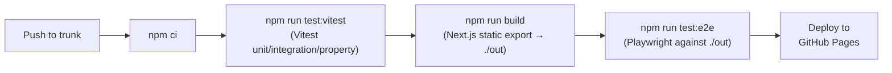

# Deployment

See also: [Architecture](architecture.md) | [Testing](testing.md)

---

## 1. GitHub Actions Workflow

File: `.github/workflows/deploy.yml`

```yaml
name: Test & Deploy

on:
  push:
    branches: [trunk]

jobs:
  test-and-deploy:
    runs-on: self-hosted

    steps:
      - uses: actions/checkout@v4

      - uses: actions/setup-node@v4
        with:
          node-version: 24
          cache: npm

      - run: npm ci

      - run: npm test                    # Full suite: Vitest + build + Playwright

      - name: Deploy to GitHub Pages
        uses: peaceiris/actions-gh-pages@v4
        with:
          github_token: ${{ secrets.GITHUB_TOKEN }}
          publish_dir: ./out
          cname: random-notes.jdc-projects.dev
```

The `npm test` script handles the full pipeline: Vitest → build → Playwright. Deployment only proceeds if all tests pass.

---

## 2. Next.js Configuration (`next.config.ts`)

```typescript
import type { NextConfig } from 'next';

const nextConfig: NextConfig = {
  output: 'export',
  images: { unoptimized: true },
};

export default nextConfig;
```

No `basePath` or `assetPrefix` — the app is served from the root of the subdomain.

---

## 3. CNAME

`public/CNAME` contains:

```
random-notes.jdc-projects.dev
```

---

## 4. Package Scripts

```json
{
  "scripts": {
    "dev": "next dev",
    "build": "next build",
    "start": "serve out -l 3000",
    "test": "npm run test:vitest && npm run build && npm run test:e2e",
    "test:vitest": "vitest run",
    "test:watch": "vitest",
    "test:e2e": "playwright test",
    "lint": "eslint src/",
    "typecheck": "tsc --noEmit"
  }
}
```

### `npm run start`

Serves the static export from `./out` using the `serve` package. **This does not build the app** — run `npm run build` first. The script prints a warning if `./out` does not exist:

```
"start": "test -d out || echo '⚠️  No build found. Run npm run build first.' && serve out -l 3000"
```

---

## 5. CI Pipeline



All steps run sequentially. If any step fails, the pipeline stops and no deployment occurs.
