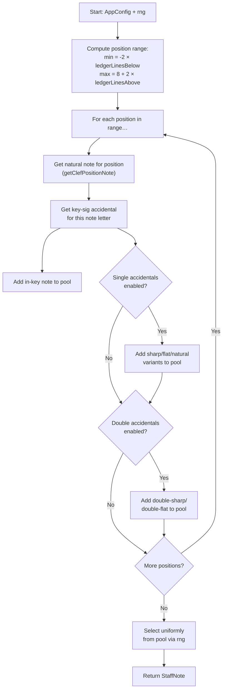

# Music Theory Logic

This document specifies the pure-logic layer in `src/lib/` — types, constants, and algorithms for note generation, transposition, and MIDI conversion. These modules have **no React dependencies** and are tested with unit and property-based tests.

See also: [Architecture](architecture.md) | [Testing](testing.md) | [Spec](spec.md)

---

## 1. Core Types (`src/lib/types.ts`)

```typescript
export type NoteLetter = 'A' | 'B' | 'C' | 'D' | 'E' | 'F' | 'G';

export type AccidentalType = 'sharp' | 'flat' | 'natural' | 'double-sharp' | 'double-flat';

export type ClefType = 'treble' | 'bass' | 'alto' | 'tenor';

export type TranspositionPitch = 'C' | 'Bb' | 'Eb' | 'F';

export type KeyMode = 'major' | 'minor';

export interface KeyAccidental {
  letter: NoteLetter;
  accidental: 'sharp' | 'flat';
}

export interface KeySignature {
  name: string;           // e.g. "G major"
  mode: KeyMode;
  accidentals: KeyAccidental[];  // ordered as they appear on the stave
}

export interface Note {
  letter: NoteLetter;
  accidental: AccidentalType | null;  // null = as per key signature (in-key)
  octave: number;
}

export interface StaffNote extends Note {
  staffPosition: number;  // 0 = bottom line, 8 = top line, negatives = below
}

export interface AppConfig {
  clef: ClefType;
  keySignature: string;               // key into KEY_SIGNATURES map
  singleAccidentals: boolean;
  doubleAccidentals: boolean;
  transposition: TranspositionPitch;
  ledgerLinesAbove: number;
  ledgerLinesBelow: number;
  timerSeconds: number | null;        // null = no timer
}

export type AppScreen = 'config' | 'notes';
```

---

## 2. Constants (`src/lib/constants.ts`)

### 2.1 Key Signatures

A record keyed by display name (e.g. `"G major"`, `"E minor"`). Contains all 30 keys as defined in the [spec §5.1](spec.md#51-key-signatures-30-keys). Each entry stores the ordered list of accidentals.

### 2.2 Clef Position Map

A function that returns the natural note name and octave for any staff position on a given clef.

Base data (position 0 = bottom line):

| Clef | Bottom-line note |
|---|---|
| Treble | E4 |
| Bass | G2 |
| Alto | F3 |
| Tenor | D3 |

Implementation approach:

```typescript
const CLEF_BOTTOM_LINE: Record<ClefType, { letter: NoteLetter; octave: number }> = {
  treble: { letter: 'E', octave: 4 },
  bass:   { letter: 'G', octave: 2 },
  alto:   { letter: 'F', octave: 3 },
  tenor:  { letter: 'D', octave: 3 },
};

const NOTE_ORDER: NoteLetter[] = ['C', 'D', 'E', 'F', 'G', 'A', 'B'];
```

Given a position (0 = bottom line), offset from the bottom-line note by `position` steps through `NOTE_ORDER`, incrementing the octave each time the sequence wraps past B → C.

### 2.3 Transposition Offsets

```typescript
const TRANSPOSITION_OFFSETS: Record<TranspositionPitch, number> = {
  'C':  0,
  'Bb': -2,
  'Eb':  3,
  'F':  -7,
};
```

Offsets are in semitones, added to the written MIDI number to get concert pitch.

### 2.4 Timer Presets

```typescript
const TIMER_OPTIONS = [
  { label: 'No timer', value: null },
  { label: '5 seconds', value: 5 },
  { label: '10 seconds', value: 10 },
  { label: '15 seconds', value: 15 },
  { label: '20 seconds', value: 20 },
  { label: '30 seconds', value: 30 },
  { label: '60 seconds', value: 60 },
] as const;
```

---

## 3. Note Generation (`src/lib/noteGenerator.ts`)

### Function Signature

```typescript
function generateNote(config: AppConfig, rng?: () => number): StaffNote;
```

The optional `rng` parameter defaults to `Math.random`. Inject a deterministic function for testing.

### Algorithm



#### Step-by-step

1. **Position range:**
   - `minPosition = -2 × config.ledgerLinesBelow`
   - `maxPosition = 8 + 2 × config.ledgerLinesAbove`

2. **Build the pool** (array of `StaffNote`):

   ```
   for each position in minPosition..maxPosition:
     { letter, octave } = getClefPositionNote(config.clef, position)
     keyAcc = getKeyAccidental(letter, config.keySignature)

     // In-key (always)
     pool += { letter, accidental: keyAcc, octave, staffPosition: position }

     if singleAccidentals:
       if keyAcc !== 'sharp':  pool += sharp variant
       if keyAcc !== 'flat':   pool += flat variant
       if keyAcc !== null:     pool += natural variant

     if doubleAccidentals:
       pool += double-sharp variant
       pool += double-flat variant
   ```

   Where `getKeyAccidental` returns `'sharp'`, `'flat'`, or `null`.

3. **Select** uniformly: `pool[Math.floor(rng() * pool.length)]`.

---

## 4. Transposition (`src/lib/transposition.ts`)

### MIDI Conversion (`src/lib/noteUtils.ts`)

```typescript
const LETTER_TO_SEMITONE: Record<NoteLetter, number> = {
  C: 0, D: 2, E: 4, F: 5, G: 7, A: 9, B: 11,
};

const ACCIDENTAL_OFFSET: Record<AccidentalType, number> = {
  'sharp': 1, 'flat': -1, 'natural': 0,
  'double-sharp': 2, 'double-flat': -2,
};

function noteToMidi(note: Note): number {
  const base = LETTER_TO_SEMITONE[note.letter];
  const accOffset = note.accidental ? ACCIDENTAL_OFFSET[note.accidental] : 0;
  return (note.octave + 1) * 12 + base + accOffset;
}

function midiToNote(midi: number, preferSharps: boolean): Note { ... }
```

### Transpose Function

```typescript
function transposeToConcert(written: Note, pitch: TranspositionPitch): Note {
  if (pitch === 'C') return { ...written };
  const midi = noteToMidi(written) + TRANSPOSITION_OFFSETS[pitch];
  const preferSharps = concertKeyUsesSharps(written, pitch);
  return midiToNote(midi, preferSharps);
}
```

`concertKeyUsesSharps` derives the concert key by transposing the written key's tonic and checking whether the resulting key has sharps or flats. For C major / A minor, default to sharps.

### Transposition Quick Reference

| Written Note | Bb Concert | Eb Concert | F Concert |
|---|---|---|---|
| C | Bb | Eb | F |
| D | C | F | G |
| E | D | G | A |
| F | Eb | Ab | Bb |
| G | F | Bb | C |
| A | G | C | D |
| B | A | D | E |
